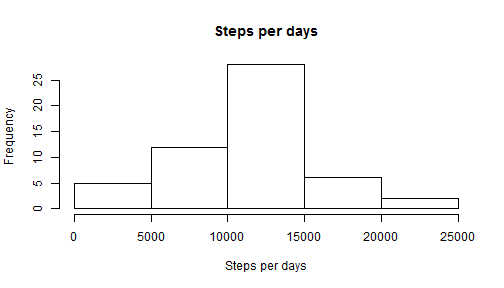
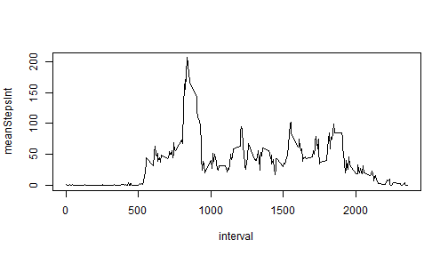
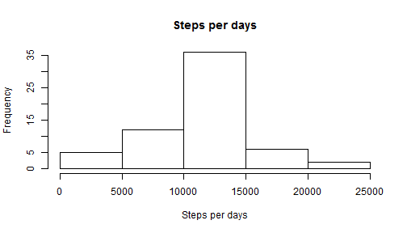
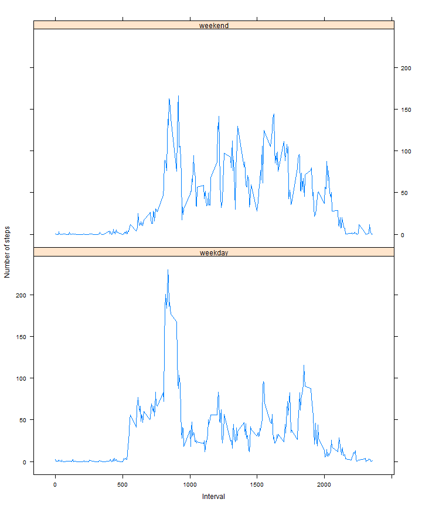

# Reproducible Research: Peer Assessment 1
It is now possible to collect a large amount of data about personal movement using activity monitoring devices such as a Fitbit, Nike Fuelband, or Jawbone Up. These type of devices are part of the "quantified self" movement - a group of enthusiasts who take measurements about themselves regularly to improve their health, to find patterns in their behavior, or because they are tech geeks. But these data remain under-utilized both because the raw data are hard to obtain and there is a lack of statistical methods and software for processing and interpreting the data.

This assignment makes use of data from a personal activity monitoring device. This device collects data at 5 minute intervals through out the day. The data consists of two months of data from an anonymous individual collected during the months of October and November, 2012 and include the number of steps taken in 5 minute intervals each day.

The data for this assignment can be downloaded from the course web site, but are anyway already included in the git repository, so it is not necessary to download it again.

The variables included in this dataset are:

* **steps**: Number of steps taking in a 5-minute interval (missing
    values are coded as `NA`)

* **date**: The date on which the measurement was taken in YYYY-MM-DD
    format

* **interval**: Identifier for the 5-minute interval in which
    measurement was taken
The dataset is stored in a comma-separated-value (CSV) file and there are a total of 17,568 observations in this dataset.


## Loading and preprocessing the data
Before to load the data I need to switch to the base directory:

```r
wd = "C:\\Users\\mmorelli\\Google Drive\\Data Science\\05 - Reproducible Research\\01 Peer\\RepData_PeerAssessment1"
setwd(wd)
```


Then the data could be loaded in the data frame *activ*:

```r
activ <- read.csv(unzip("./activity.zip"), stringsAsFactors = F)
```


Now I get a column with the Date in *Date* format and switch to English Locale (just to conform to the rest of the class). Then select only the complete cases in the dataframe *activ.complete*:

```r
# date to date type, Format interval
activ$dateAsDate <- as.Date(activ$date, "%Y-%m-%d")

# set locale and be sure is the right trellis setting
Sys.setlocale("LC_TIME", "English")

activ.complete <- activ[complete.cases(activ), ]
```


## What is mean total number of steps taken per day?
Now I am ready to get to the first request. I calculate the steps per days:

```r
library(plyr)
byday <- ddply(activ.complete, ~dateAsDate, summarise, stepsPerDay = sum(steps))
```


Then make an Histogram of the total number of steps taken each day:

```r
hist(byday$stepsPerDay, main = "Steps per days", xlab = "Steps per days")
```

 


The mean of the steps per day is:

```r
mean(byday$stepsPerDay)
```

```
## [1] 10766
```


And the median is:

```r
median(byday$stepsPerDay)
```

```
## [1] 10765
```


## What is the average daily activity pattern?
The second request is in two parts. First I need to show a time series plot of the 5-minute interval and the average number of steps taken, averaged across all days. To do this I summarize over the average day:

```r
byInterv <- ddply(activ.complete, ~interval, summarise, meanStepsInt = mean(steps))
```


The following code make the plot:

```r
with(byInterv, plot(interval, meanStepsInt, type = "l"))
```

 


For the second part of this request, I need to find which 5-minute interval, on average across all the days in the dataset, contains the maximum number of steps? 

```r
byInterv[which(byInterv$meanStepsInt == max(byInterv$meanStepsInt)), ]$interval
```

```
## [1] 835
```


As could be seen, the 5-min inteval with the maxinum number of steps is the one that begins at 8:35 AM.

## Imputing missing values
There are a number of days/intervals where there are missing values (coded as NA). The presence of missing days may introduce bias into some calculations or summaries of the data. So it is requested to devise a strategy to fill the missing data.

First see how many missing data there are:

```r
sum(!complete.cases(activ))
```

```
## [1] 2304
```


As a filling strategy I assign the mean of the steps in that 5-min interval (taken to the non-missing data) to the missing data. I memorize the result in the data frame *activ.fil*:


```r
activ.fil <- activ
# an iterative solution is slower but in my opinion more clear
for (i in which(is.na(activ$steps))) {
    activ.fil[i, "steps"] <- byInterv[which(byInterv$interval == activ.fil[i, 
        "interval"]), ]$meanStepsInt
}
```


Now it can be seen that there is no missing data anymore:

```r
sum(!complete.cases(activ.fil))
```

```
## [1] 0
```


It is requested to produce a new Histogram. I do not expect big variations, giving that my strategy minimized them. A new data frame to contain the ummarized data is *activ.fil*:

```r
byday.fil <- ddply(activ.fil, ~dateAsDate, summarise, stepsPerDay = sum(steps))
```


The following code make the plot:   

```r
hist(byday.fil$stepsPerDay, main = "Steps per days", xlab = "Steps per days")
```

 


Not much different, as forecasted. 
The mean of the steps per day is:

```r
mean(byday.fil$stepsPerDay)
```

```
## [1] 10766
```


And the median is:

```r
median(byday.fil$stepsPerDay)
```

```
## [1] 10766
```


Now median and mean are the same.


## Are there differences in activity patterns between weekdays and weekends?
Here I get to the last section of the assignment. It is requested to analyze te differences in activity patterns between weekdays and weekend, using the dataset with the filled-in missing values.

First, I prepare the data frame *active.fil* with an additional field that distinguishes between weekdays and weekeend:

```r
activ.fil$wday <- "weekday"
activ.fil[weekdays(activ.fil$dateAsDate, abbreviate = T) %in% c("Sun", "Sat"), 
    "wday"] <- "weekend"
# now transform in a factor as requested
activ.fil$wday <- as.factor(activ.fil$wday)

byInterv.fil <- ddply(activ.fil, ~interval + wday, summarise, meanStepsInt = mean(steps))
```


Then I could plot the requested graph, using the *lattice* library:

```r
# final graph
library(lattice)
xyplot(meanStepsInt ~ interval | wday, data = byInterv.fil, layout = c(1, 2), 
    type = "l", ylab = "Number of steps", xlab = "Interval")
```

 


The pattern are substantially different. In particular there is a substantially bigger spike in the early morning in weekdays.


